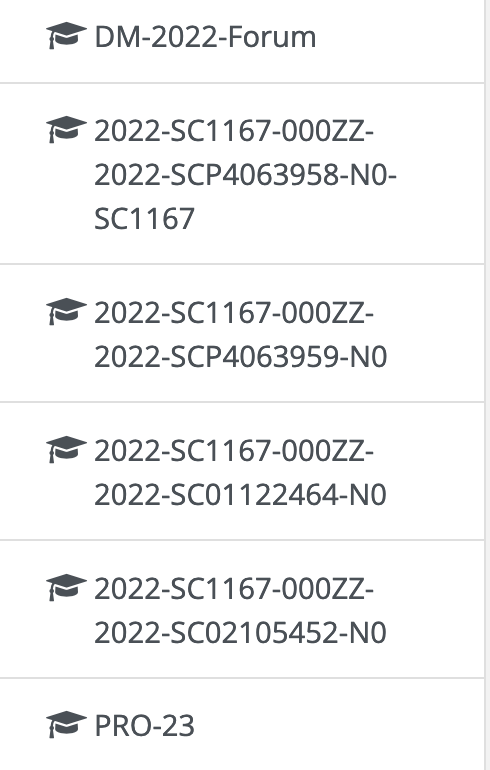

# moodle_sidebar_rewriter

Tired of professors naming courses in Moodle like this?

This script can make them more like this:

## Installation

Install [ViolentMonkey](https://violentmonkey.github.io/get-it/), then simply open [this link](https://raw.githubusercontent.com/esposm03/moodle_sidebar_rewriter/main/script.user.js). And that's it, you're done!